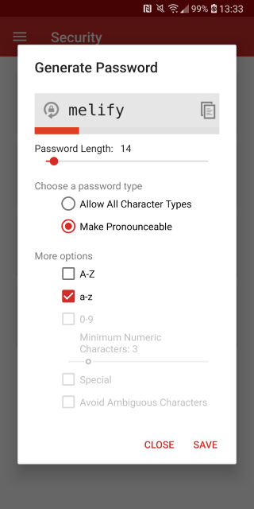
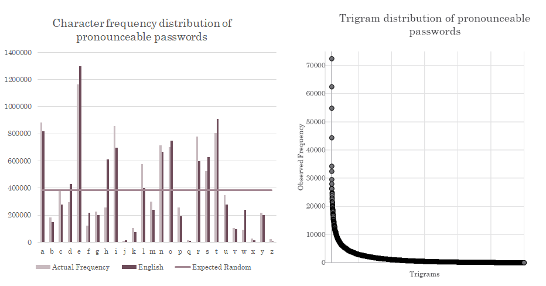

LastPass' Android app is one of the most downloaded passwords managers on the Play Store with over 10 million
installations. I investigated security issues with the app for my capstone project. Here are some of the biggest
problems I found with it.

## Password Generator

The app's password generator can generate two types of passwords: pronounceable or non-pronounceable. The pronounceable
password generator has several issues, the biggest one of them being its inability to produce passwords of lengths that
you specify. Don't believe me? See the screenshot below.



Although this is an extreme case, I found out that approximately one percent of all pronounceable passwords generated
by this app are smaller than specified. This is the distribution of lengths of produced passwords when set to generate
passwords of length 16:

```text
sqlite> select length(password) as len, count(*)
        from pronounceable_16 group by len;
len  count(*)
---  --------
3    687
4    725
5    654
6    721
7    732
8    685
9    688
10   733
11   693
12   675
13   645
14   654
15   643
16   991065
```

I suspect that nobody counts the number of characters in the generated passwords. On my device, I can't even see the
entire password if it is more than 14 characters long. If you use or have used the option in the past to generate
pronounceable passwords, check the lengths of your passwords. You may find that some of them are smaller than what
you wanted.

Moreover, the character distribution is not great. Just 500 distinct trigrams make up over 50 percent of all produced
three character sequences in passwords. The frequency distribution of characters produced by the generator is not so
good either.



An important thing to note here is that LastPass is using [Tom van Vleck's pronounceable password generator](https://www.multicians.org/thvv/gpw.html).
LastPass has modified it to use [`java.security.SecureRandom`](https://developer.android.com/reference/java/security/SecureRandom).
The original password generator only produces lowercase passwords; LastPass uses the generated password and then randomly
makes characters in it uppercase if the `A-Z` option is selected.

The strength meter that LastPass includes just below the generated password, [zxcvbn4j](https://github.com/nulab/zxcvbn4j),
does not indicate the true strength as it is not designed to take into account the character distribution. As a result,
the strengths of produced passwords is overestimated. If someone learns that you've used the option to generate
pronounceable passwords, the strength of your passwords against a brute-force attack will decrease by several orders of
magnitude.

## LastPass Browser

The app includes a web browser built on Android WebView. The biggest issue with the browser is that it leaks user
searches through DNS and TLS SNI. Let's say you type in `foobar` into the box. The app makes a brilliant decision and
takes the user to `www.foobar.com`. This, unsurprisingly, requires making a DNS query. DNS requests are unencrypted:
anyone listening on the wire can see that you are interested in `foobar`. The fact that LastPass manages your passwords
makes it even more dangerous. If you accidentally paste a password from the clipboard into the browser, everyone knows
your password now. Even if you use [encrypted DNS](https://blog.cloudflare.com/dns-encryption-explained/), the password
may still be visible in plaintext through TLS server name indication (SNI).

## Other Issues

The app has a few other issues:

* Security checkup, a feature intended to warn users of reused passwords fails to do just that. To verify, just create
  two logins with the same passwords. You will not see the app detecting the duplicates.
* Weak master password policy: Your password manager is only as secure as your master password. I was able to easily set
  an extremely weak password, `aaaaaaaaaaA1`, as the master password without any warnings.

## How did I find all this?

I studied Android password manager apps for my final project during my undergraduate studies. I also found other security
issues in the LastPass app that are intentionally not included in this blog post. Complete details and observations are
documented in my submitted thesis which I will make public very soon. I have also analysed two more popular password
managers and would be writing about my findings very soon.

If you have any doubts or comments, please feel free to reach out to me. I will be happy to share all my findings and
observations.

### Responsible Disclosure

I have informed LastPass about all of these issues a few weeks ago. I think that they have already fixed a few of them.
Hopefully, they will fix the remaining issues very soon.
