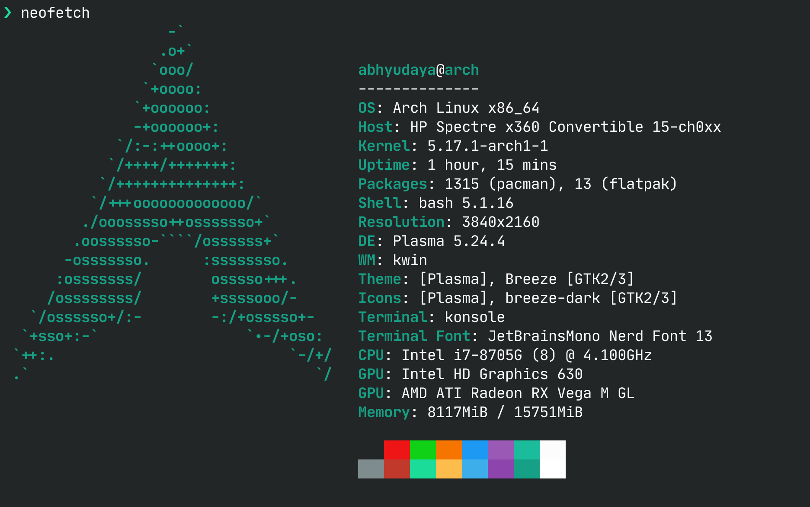
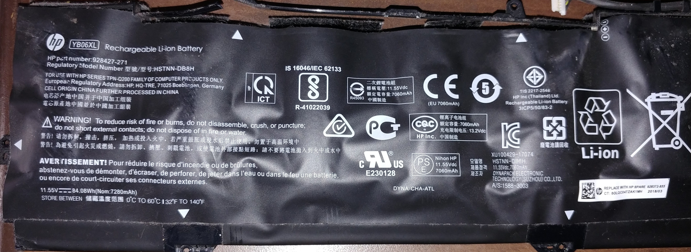

## Background

I think I first used Linux when I was 12 or 13. I still have a CD in one of my drawers with the Ubuntu 12.04 ISO. I've
been using Linux in one way or another ever since. However, Windows has been my primary OS as far as I remember. But
not anymore!

The spark to install Linux on my personal laptop came from an unexpected source. In January, Docker Desktop for Windows
switched from being free to costing a minimum of $5/month. Since I am working at Dell and company's revenue far exceeds
$10 million, we were supposed to pay for it. There was as internal process for which my team signed up to get the
licenses but as of writing, we still don't know what happened to the licenses. So, I started looking at potential
alternatives. I could probably just use Docker inside WSL2 directly but the lack of systemd made me not want to go ahead
with it. Instead, I decided that I'll try out a full HyperV VM. I had been reading how much better KDE was on Wayland
now and decided to try out the latest KDE release. Even though I had never used Arch before, I decided to try it out
for its rolling release model. It was just a VM, I could just start over with a different distro if I didn't like it.

After following the long installation guide, I really liked the fact that I had complete control of what runs in the
VM. The experience with KDE/Wayland was so good in fact that I decided to move all my dev work to the VM. After
using it for about a week, I was wondering how Arch would run on my personal HP laptop.

My laptop is a 2018 HP Spectre x360 15-inch with an i7-8705G processor. The performance was good for the time and I
thought the GPU would be sufficient for light gaming and video editing. Unfortunately, HP locked both the Intel and AMD
GPU drivers and I couldn't update them. I thought that HP would continue providing updated drivers for at least a few
years but they stopped releasing driver updates in early 2019. As a result, newer games would not run properly. Moreover,
the performance always felt a bit slow. I tried to force some applications off to the AMD dGPU and that did improve
things an extent but moving around in Windows and dragging on the desktop felt laggy.

My laptop was about 4 years old at this point and its battery had begun swelling up a few months ago. I continued to
use the laptop since [HP says that is not a safety hazard](https://support.hp.com/us-en/document/ish_4158581-4158704-16).
The battery continued to increase in size until it broke off all screws holding the back cover of my laptop. Once the
cover came off, I finally removed the battery. Thankfully, the laptop would still work without the battery when on
power. This was not a major problem since I do not need to take the laptop anywhere these days and use I it like a
desktop. The only issue with running the laptop without a battery was that the [CMOS memory](https://en.wikipedia.org/wiki/Nonvolatile_BIOS_memory)
would reset whenever the laptop would be unplugged. Because of this, I would need to re-enable [VT-x](https://en.wikipedia.org/wiki/X86_virtualization)
at every boot to use WSL2.



It was at this point that I decided to switch to Arch. I wanted to set up [secure boot](https://en.wikipedia.org/wiki/Unified_Extensible_Firmware_Interface#Secure_Boot) with my own keys and full disk
encryption for my Linux install. However, the key stored in the BIOS would be reset every time the laptop would be
unplugged. Since I would need to go into the BIOS anyway to enable virtualization, I decided turning secure boot off
wouldn't be much additional work.

For full disk encryption, I decided to only have GRUB on an unencrypted partition. The rest of the disk would be
encrypted using LUKS1. LUKS2 is a better option since it provides [AEAD](https://en.wikipedia.org/wiki/Authenticated_encryption).
I could probably also have used LUKS2 since GRUB now partially supports it but the setup seemed complex and I just used
LUKS1.

## Installation Steps

> ⚠️ These steps are intended to be a log of what I did to get my laptop to a satisfactory state and expect a basic
understanding of the shell and Linux. This process will delete all data from your drive; create a full backup before
installation. The steps may change with time. Please read the [official installation guide](https://wiki.archlinux.org/title/Installation_guide)
before installing Arch on your computer.

First, download the [Arch ISO](https://archlinux.org/download/) and burn it to a USB flash drive. My preferred tool for
burning ISOs is [Balena Etcher](https://www.balena.io/etcher/). Then boot into your computer's UEFI firmware settings.
If you were running Windows 10 like I was, you can achieve this using the [advanced startup options](https://support.microsoft.com/en-us/windows/advanced-startup-options-including-safe-mode-b90e7808-80b5-a291-d4b8-1a1af602b617).
In the firmware settings, set secure boot to disabled and enable booting from USB. For my HP laptop, I also needed to
enable 'Legacy Boot Support'. Also change the boot priority order so that the UEFI boots from the USB before any
installed disk. Save the changes, insert your flash drive into a USB port, and reboot. You should be now logged into
the Arch ISO.

Once booted into the Arch ISO, verify that you are booted into EFI mode by running

```bash
ls /sys/firmware/efi/efivars
```

If this directory does not exist, enable UEFI boot in your firmware settings.

The next step is to enable internet access. If you use ethernet, your system should already have access to the internet.
If you use, Wi-Fi, you will have to do extra setup. I used [iwctl](https://man.archlinux.org/man/iwctl.1).

```text
$ iwctl
[iwd]# station <INTERFACE_NAME> connect <SSID>
```

Here, `INTERFACE_NAME` is the name of your Wi-Fi interface and be found using `ip link show`. For me, it was `wlan0`.

Verify your internet connection, for instance, by `curl -I https://abhyudaya.dev/`. Also enable [NTP](https://en.wikipedia.org/wiki/Network_Time_Protocol)
time sync:

```bash
timedatectl set-ntp true
```

Next, we need to partition our disk(s). Check if all your disks are showing up in the ISO using [`lsblk(8)`](https://man.archlinux.org/man/lsblk.8).
For my laptop with a single NVME disk (`nvme0n1`), I used this setup:

```text
| Mount point | Partition  | Type                                | Size      |
|-------------|------------|-------------------------------------|-----------|
| /mnt/efi    | nvmen0p1   | EFI System Partition                | 500 MiB   |
| /mnt/       | nvmen0p2   | Root partition encrypted with LUKS1 | Remaining |
```

I used [`gdisk(8)`](https://man.archlinux.org/man/gdisk.8) to first delete all existing partitions from my existing Windows
install and create the two required partitions. If you want to learn how to use `gdisk`, [this](https://www.rodsbooks.com/gdisk/walkthrough.html)
is a good tutorial.

Now, we will initialize filesystems on these partitions. Before proceeding, verify using `lsblk` that the required
partitions exist and are not mounted. The EFI system partition (ESP) will be formatted as [VFAT](https://en.wikipedia.org/wiki/File_Allocation_Table#VFAT).

```bash
mkfs.vfat -n EFI /dev/nvme0n1p1
```

The root partition needs to be prepared for encryption using [`cryptsetup(8)`](https://man.archlinux.org/man/cryptsetup.8)
and mounted at `/dev/mapper/cryptroot`. Select a strong password for the disk encryption and do not forget it. If you
lose this password, you will not be able to recover any data from your disk.

```bash
cryptsetup luksFormat --type luks1 /dev/nvme0n1p2
cryptsetup --allow-discards open /dev/nvme0n1p2 cryptroot
```

Here, `--allow-discards` enables [TRIM](https://en.wikipedia.org/wiki/Trim_(computing)) support for SSDs.
Enabling trim can improve SSD performance but comes with [security drawbacks](https://wiki.archlinux.org/title/Dm-crypt/Specialties#Discard/TRIM_support_for_solid_state_drives_(SSD)).
I do not care plausible deniability; I'm writing about encrypting my disk on the internet! Extra performance is always
nice.

I decided to use `btrfs` for the root partition for its built-in transparent zstd compression, optimizations for SSDs,
and snapshots. The next set of commands will format the mapped partition as btrfs and mount it at `/mnt`. Then we create
subvolumes which can be snapshotted individually.

```bash
mkfs.btrfs /dev/mapper/cryptroot
mount /dev/mapper/cryptroot /mnt
cd /mnt
btrfs subvolume create @
btrfs subvolume create @home
btrfs subvolume create @swap
btrfs subvolume create @snapshots
btrfs subvolume create @var
btrfs subvolume create @var/log
btrfs subvolume create @var/tmp
cd
umount /mnt
```

Then we mount the ESP and all created subvolumes:

```bash
mount /dev/nvme0n1p1 /mnt/efi -o discard   # -o discard enables TRIM
mount /dev/mapper/cryptroot /mnt/ -o subvol=@,compress-force=zstd,noatime,space_cache=v2,ssd,discard=async

mkdir -p /mnt/{efi,.snapshots,swap,home,var/log,var/tmp}

mount /dev/mapper/cryptroot /mnt/home -o subvol=@home,compress-force=zstd,noatime,space_cache=v2,ssd,discard=async
mount /dev/mapper/cryptroot /mnt/swap -o subvol=@swap,compress=no,noatime,space_cache=v2,ssd,discard=async,nodatacow
mount /dev/mapper/cryptroot /mnt/.snapshots -o subvol=@snapshots,compress-force=zstd,noatime,space_cache=v2,ssd,discard=async
mount /dev/mapper/cryptroot /mnt/var -o subvol=@var,compress-force=zstd,noatime,space_cache=v2,ssd,discard=async
mount /dev/mapper/cryptroot /mnt/var/log -o subvol=@var/log,compress-force=zstd,noatime,space_cache=v2,ssd,discard=async
mount /dev/mapper/cryptroot /mnt/var/tmp -o subvol=@var/tmp,compress-force=zstd,noatime,space_cache=v2,ssd,discard=async

chattr +C /mnt/swap
```

Here we disable access time storage with `noatime` since btrfs is a copy-on-write file system and all file reads would
lead to extra disk writes if we were logging access times. We also force zstd compression. This will generally lead to
lower disk usage at the cost of some CPU cycles. SSD optimizations are enabled with `ssd` and TRIM support is enabled
with `discard=async`. We also make use of `space_cache` which can improve performance. All mount options are documented
[here](https://btrfs.readthedocs.io/en/latest/btrfs-man5.html?highlight=space_cache#mount-options). Notice that we
enabled discard for both the LUKS encryption layer and our subvolumes. This is necessary because btrfs will pass all
TRIM commands to LUKS. Therefore, we need to enable TRIM at both layers.

This setup also allows us to have an encrypted [swapfile](https://btrfs.readthedocs.io/en/latest/Swapfile.html). Because
of how btrfs works, the swapfile should not be compressed (`compress=no`) and copy-on-write should be disabled
(`nodatacow` and `chattr +C`).

Now, our disk is ready for installing Arch. To install the OS, we use `pacstrap`:

```bash
pacstrap /mnt/ base linux linux-firmware intel-ucode \
  neovim man-db man-pages btrfs-progs grub cryptsetup \
  dosfstools efibootmgr base-devel git sudo bash \
  xdg-user-dirs bash-completion neofetch iwd bluez \
  bluez-utils cups cups-pdf
```

The first argument is the path that would become the system root. All other arguments are the packages we require. `linux`
is the Linux kernel, `linux-firmware` contains firmware files, `base` is the minimal Arch installation, `intel-ucode`
contains microcode updates for our CPU, `neovim` is a text editor, `man-db` and `man-pages` are for man pages,
`btrfs-progs` contains utilities to manage btrfs file systems, `grub` is the bootloader, `cryptsetup` is for managing
LUKS encrypted disks, `dosfstools` and `efibootmgr` are for managing the ESP and EFI boot, `base-devel` contains tools
for compiling applications like `gcc` and `automake`, `sudo` is for elevating privileges, `bash` is a shell,
`xdg-user-dirs` can create user directories like `Desktop` and `Documents`, `bash-completion` is for tab completion in
bash, `iwd` is for Wi-Fi, `bluez` and `bluez-utils` are for Bluetooth, and finally `cups` and `cups-pdf` are for
printing. This command takes some time as it downloads all packages from the internet.

Once packages are installed, we need to persist our file system mounts. This information is stored in `/etc/fstab`. The
file can be generated using `genfstab`:

```bash
genfstab -U /mnt >> /mnt/etc/fstab
```

As it currently stands, our disk would first be decrypted by GRUB which loads the kernel and the initial ramdisk and
then again by the kernel. To avoid entering password twice, we add a key file as a possible LUKS decryption key which
would also be copied to the initial ramdisk. Instead of asking us for password, the kernel would use this file to
unlock the root partition.

```bash
dd bs=512 count=8 if=/dev/random of=/mnt/cryptlvm.keyfile
chmod 000 /mnt/cryptlvm.keyfile
cryptsetup -v luksAddKey /dev/nvmen0p2 /mnt/cryptlvm.keyfile
```

We will now create the ramdisk. `/mnt/etc/mkinitcpio.conf` contains the configuration for generating the ramdisk.

```bash
cp /mnt/etc/mkinitcpio.conf /mnt/etc/mkinitcpio.conf.bak  # backup the original configuration
```

Open `/mnt/etc/mkinitcpio.conf` in your preferred text editor and edit the `HOOKS`, `BINARIES` and `FILES` arrays so
they look like this:

```bash
BINARIES=(btrfs)
HOOKS=(base systemd autodetect keyboard sd-vconsole modconf block sd-encrypt lvm2 filesystems fsck)
FILES=(/cryptlvm.keyfile)
```

Now, we will configure the systemd init hook to decrypt our root partition using `/cryptlvm.keyfile`. To do this,
add the following arguments to `GRUB_CMDLINE_LINUX` variable in `/mnt/etc/default/grub`.

```
rd.luks.name=XXXXXXXX-XXXX-XXXX-XXXX-XXXXXXXXXXXX=cryptroot
rd.luks.key=XXXXXXXX-XXXX-XXXX-XXXX-XXXXXXXXXXXX=/cryptlvm.keyfile
rd.luks.options=discard
```

Replace `XXXX-XXXX...` with the LUKS UUID. The UUID can be found using `cryptsetup luksUUID /dev/nvme0n1p2`. If you
have multiple disks, you can have multiple `rd.luks.name` and `rd.luks.key` arguments. Note that we have enabled TRIM
support here again.

Now, chroot into our Arch installation using `arch-chroot /mnt`. The next step is to set up our clock.

```bash
# Replace Asia/Kolkata with your timezone
ln -sf /usr/share/zoneinfo/Asia/Kolkata /etc/localtime
hwclock --systohc
```

Next, edit `/etc/locale.gen` and uncomment `en_US.UTF-8 UTF-8` and other locales you require. Then, run `locale-gen` to
generate the locales. You may also need to persist your keyboard language in `/etc/vconsole.conf`. For a standard US
ANSI keyboard layout, `echo KEYMAP=us > /etc/vconsole.conf` does the trick. See the official installation guide and
[`vconsole.conf(5)`](https://man.archlinux.org/man/vconsole.conf.5) for more information.

We now need to set up our hostname. Running `echo arch > /etc/hostname` will set the hostname to `arch`. Now, we can
enable networking. I use systemd-networkd on my laptop since it comes included with systemd.

```bash
systemctl enable systemd-{networkd,resolved}.service
```

Then, set up the root password using `passwd`. Make sure that you use a strong password and store it somewhere safe, for
example, in a password manager. This password won't be necessary unless you get locked out of your primary account. We
will create the primary account later.

The next step is to create the initial ramdisk and set it to be only readable by the root user. Setting the permissions
is important because the ramdisk images contain our disk encryption key.

```bash
mkinitcpio -P
chmod 600 /boot/initramfs-linux*
```

Now, we will install GRUB, our bootloader, to `/efi`.

```bash
grub-install --target=x86_64-efi --efi-directory=/efi --bootloader-id=GRUB
grub-mkconfig -o /boot/grub/grub.cfg
```

Our installation is now almost complete. We just need to safely close all mounted devices.

```bash
exit  # exit arch-chroot
umount -R /mnt
cryptsetup close /dev/mapper/cryptroot
```

Now, remove the installation disk and `reboot`. If you followed the steps correctly, you should be booted into GRUB in a
few seconds. Enter your disk encryption password; the disk will unlock, and you can select to boot into Arch. Log in as
root. You are now inside your Arch install! 🎉

Obviously, there are still quite a few things to do:

1. Setup swapfile at `/swap/swapfile` as described [here](https://btrfs.readthedocs.io/en/latest/Swapfile.html)
2. Setup Bluetooth as described [here](https://wiki.archlinux.org/title/Bluetooth#Installation)
3. Enable printing by running `systemctl enable cups.service`

Once these are done, we can connect to Wi-Fi. Create a file in `/etc/systemd/network` called `01-wifi.network` and add
the following to it.

```ini
[Match]
Name=wlan0

[Network]
DHCP=yes
IPv6PrivacyExtensions=true
```

Now, enable and start `iwd.service`.

```bash
systemctl enable iwd.service
systemctl start iwd.service
```

Also enable `fstrim.timer` using `systemctl enable fstrim.timer` to enable periodic TRIM.

Use `iwctl` to connect to your Wi-Fi network as described earlier. Verify that your internet works. Once you have
internet access, run `pacman -Syu` to upgrade all packages.

Now, we will create our primary user. My username would be `abhyudaya`.

```bash
useradd --create-home abhyudaya
usermod --append --groups wheel abhyudaya
passwd abhyudaya
```

Edit your sudo configuration using `visudo` and uncomment the following line:

```text
%wheel ALL=(ALL:ALL) ALL
```

Reboot and login as your primary user. You should now be able to run `sudo echo hello`. The only thing missing now is a
desktop environment. Install your preferred DE as described in the [Arch Wiki](https://wiki.archlinux.org/title/Desktop_Environment).
I wanted to use KDE and installed it using `pacman -S plasma kde-applications plasma-wayland-session sddm`. Enable
`sddm.service` and reboot. You should now have a login screen. Choose X11 or Wayland in the bottom left corner and log
in with your primary user.

Once logged in, install a web browser using `pacman`. For example, you can install Firefox by running `pacman -S firefox`.
You should now have a fully working and infinitely customizable Arch installation!

Note: if you use Docker, I would highly recommend installing AppArmor at this point. See the [wiki](https://wiki.archlinux.org/title/Apparmor#Installation)
on how to install it.

## The Linux experience on my laptop

Surprisingly, most things on my laptop worked out of the box. The touchscreen, speakers, microphone, webcam, SD card
reader, tablet mode detection, physical volume buttons, brightness control, multimedia keys and other buttons on the
function keys, trackpad, Wi-Fi, Bluetooth, keyboard backlight and Thunderbolt worked without any extra configuration.
However, compared to Windows, a few things do not work: automatic rotation, the fingerprint sensor, and a small
orange light that turns on when volume is muted. These issues are so small that I can ignore them most of the time.

I haven't really tried to set up the fingerprint scanner because I do not use it, but I think it should be possible with
some effort. One thing that really troubles me is sleep. When it works, my laptop wakes up and goes to sleep faster than
a MacBook. When it doesn't, the screen turns into a colorful mess and even restarting the desktop environment doesn't
fix it. The only solution is a reboot. Another issue I often experience is shutdown taking a long time. Sometimes, it
takes just a couple of seconds to power off. Otherwise, it takes more than a minute possibly because systemd waits for
a process to exit. Other than that, I've had trouble making hardware video acceleration work properly.

On the upside, after setting `DRI_PRIME=1`, I can run my entire desktop environment on my dGPU. On Windows, just
dragging around on the desktop felt like playing a game at 10 fps. Dragging on my 10-year-old Windows desktop feels
flawless. I saw the same frame drops on Linux when using the iGPU or the desktop environment. I think I just lost the
silicon lottery with my chip. Thankfully, switching to the AMD GPU solved all my problems. My laptop has never felt so
fast! Webpages load instantly, animations run super smooth, and everything just feels fast.

Although I haven't tried many games, gaming is a mixed bag. Minecraft runs so much better than in Windows. It feels like
I have OptiFine installed even when I don't. My frame rates went from ~60fps on 1080p on Windows to around ~110fps on
Linux with the same settings and render distance. On the other, CS:GO runs significantly worse. I don't remember the
exact frame rates on Windows, but I never had any issues and it was >60fps all the time. On Linux, I have weird lag
spikes and frame drops and the game is unplayable. Anyway, I'm happy that I can play games made after 2018 without
[missing textures](https://www.reddit.com/r/halo/comments/qyc5s8/help_missing_textures_glitch_halo_infinite/) or other
graphical bugs resulting from ancient drivers.

My experience with Wayland on my AMD GPU has been quite smooth. Apart from occasional bugs with KDE, apps running
natively on Wayland look and scale much better than on X11. Windows scale perfectly even across monitors with
different DPIs. I must say that scaling generally works better than on Windows 10. Sadly, not all applications run on
Wayland right now, including my favorite IDE, IntelliJ IDEA. These applications make use of XWayland to translate X11 to
Wayland. As far as I can tell, on KDE, XWayland apps are rendered at a maximum resolution of 1920x1080 and then scaled
to your native resolution. This makes these apps look blurry on a HiDPI display.

I think I could open several bug reports and even contribute some fixes. Unfortunately, I do not have much free time
these days to investigate and fix these issues; it took me over two months to finish writing this post!

## Conclusion

Installing Arch and setting up my laptop helped me learn a lot of things that I wouldn't have from a standard Ubuntu or
Fedora install. I can run my desktop environment on my dGPU and my laptop is surprisingly faster on Linux than it was on
Windows. Plus, it feels great to have the latest versions of your favorite devtools at all times. However, there are
several major annoyances like flaky sleep and long shutdowns that would significantly degrade the experience of using a
laptop for most people.

Am I going to switch back to Windows? No. This laptop became a desktop when I removed its swollen battery and I don't
care about most of these issues. I can just leave it with its screen off when I'm not using it. The GPU drivers on Linux,
although far from perfect, are much newer and better than what HP was locking this laptop to on Windows. However, if I
were in university and taking this laptop to class, I would most probably have gone back to Windows.

Given how well my old desktop without any weird hardware runs on Linux, I would attribute most problems I saw to poor
support for relatively rare hardware. The next time I go to buy a laptop, Linux support would be one of my
priorities, and I'll try to stick to popular hardware in hopes of better drivers.
